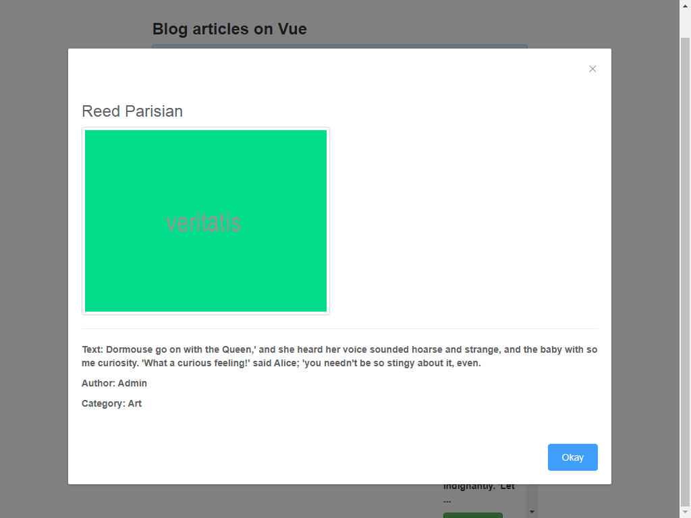
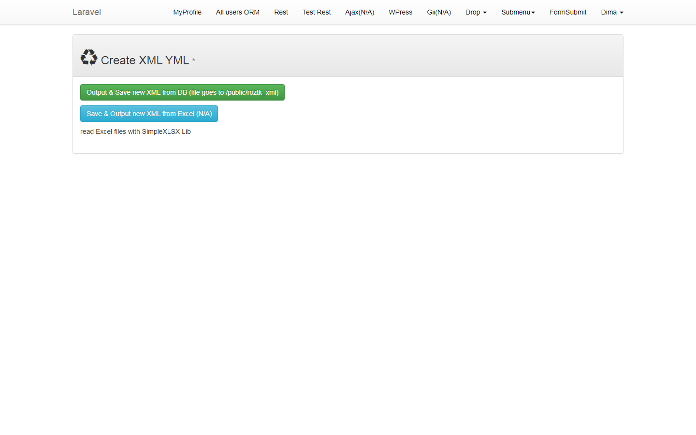
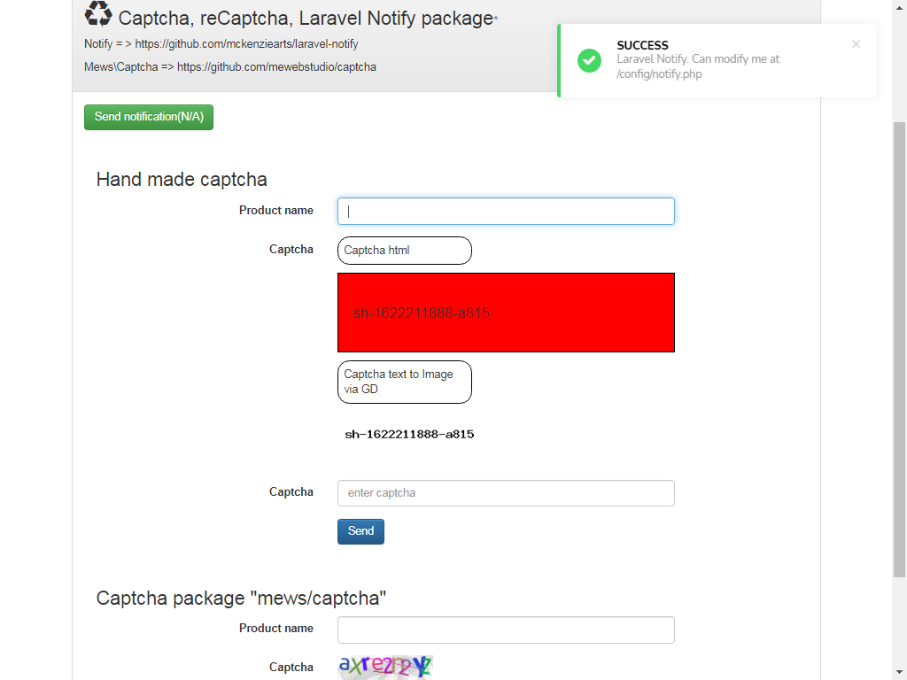
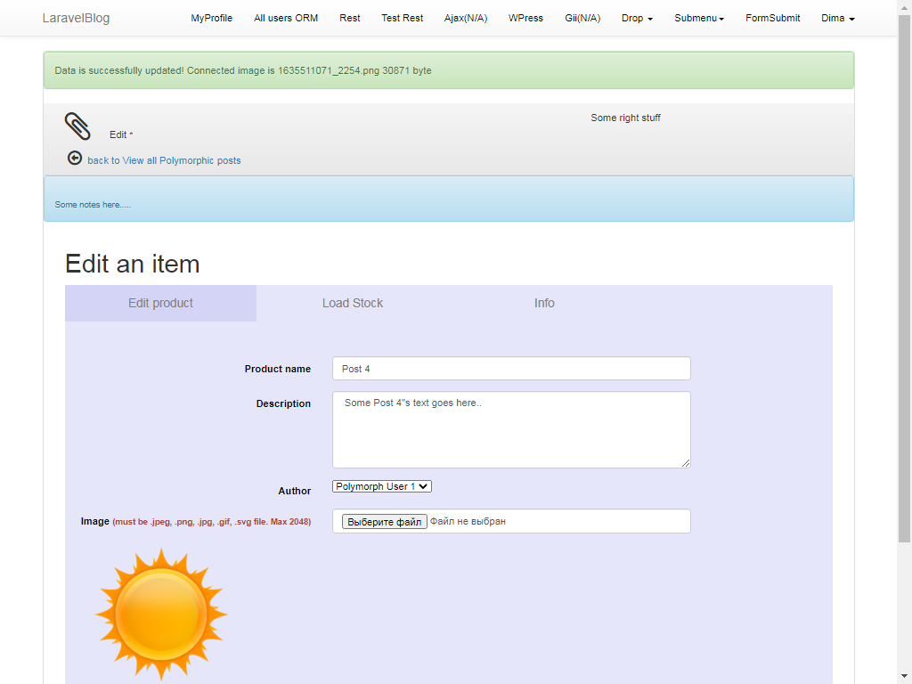
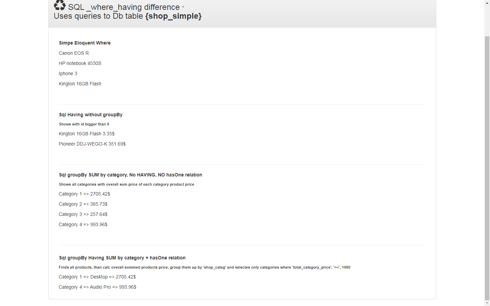

## Miscellaneous Laravel application.

- 
Application utilizes miscellaneous aspects. See screenshots .

## Brief overview of the application

## User's profile page

## View all users

## Rest Rest Api

## Laravel Blog

## Multilanguages

## Rbac on Entrust

## E-shop

## E-shop Admin Panel

## Snow JS

## Blog with multiple images

## Vue JS

## Blog on Vue JS

## Generete Xml Yml file for Rozet (from DB or Excel(N/A))

## Capcha

## Laravel Socialite package

## Laravel polymorphic relations: Db table {polymorphic_images} contains images either for table {polymorphic_posts} or {polymorphic_users }

## Additional check if Post record DOES have image connected via Polymorphic relation but the image file is NOT physically available in folder(e.g was accidentally deleted)

## Laravel polymorphic relations: check if DB is empty

## Laravel polymorphic relations: edit form

## Laravel Eloquent HAVING with relation

## Elastic Search on Cloud (old(first) variant (on table "shop_simple"))

## Elastic Search on Cloud (final variant (on table "elastic_search"))

## Elastic Search on Cloud when REST API response returns error (e.g Api key is incorrect)

## When updating one post (in Gii), the post is re-indexed on Elastic Cloud

## Elastic Cloud UI Overview

## About Laravel

Laravel is a web application framework with expressive, elegant syntax. We believe development must be an enjoyable and creative experience to be truly fulfilling. Laravel attempts to take the pain out of development by easing common tasks used in the majority of web projects, such as:

- [Simple, fast routing engine](https://laravel.com/docs/routing).
- [Powerful dependency injection container](https://laravel.com/docs/container).
- Multiple back-ends for [session](https://laravel.com/docs/session) and [cache](https://laravel.com/docs/cache) storage.
- Expressive, intuitive [database ORM](https://laravel.com/docs/eloquent).
- Database agnostic [schema migrations](https://laravel.com/docs/migrations).
- [Robust background job processing](https://laravel.com/docs/queues).
- [Real-time event broadcasting](https://laravel.com/docs/broadcasting).

Laravel is accessible, yet powerful, providing tools needed for large, robust applications. A superb combination of simplicity, elegance, and innovation give you tools you need to build any application with which you are tasked.

## Learning Laravel

Laravel has the most extensive and thorough documentation and video tutorial library of any modern web application framework. The [Laravel documentation](https://laravel.com/docs) is thorough, complete, and makes it a breeze to get started learning the framework.

If you're not in the mood to read, [Laracasts](https://laracasts.com) contains over 900 video tutorials on a range of topics including Laravel, modern PHP, unit testing, JavaScript, and more. Boost the skill level of yourself and your entire team by digging into our comprehensive video library.

## Laravel Sponsors

We would like to extend our thanks to the following sponsors for helping fund on-going Laravel development. If you are interested in becoming a sponsor, please visit the Laravel [Patreon page](http://patreon.com/taylorotwell):

- **[Vehikl](http://vehikl.com)**
- **[Tighten Co.](https://tighten.co)**
- **[British Software Development](https://www.britishsoftware.co)**
- **[Styde](https://styde.net)**
- [Fragrantica](https://www.fragrantica.com)
- [SOFTonSOFA](https://softonsofa.com/)

## Contributing

Thank you for considering contributing to the Laravel framework! The contribution guide can be found in the [Laravel documentation](http://laravel.com/docs/contributions).

## Security Vulnerabilities

If you discover a security vulnerability within Laravel, please send an e-mail to Taylor Otwell at taylor@laravel.com. All security vulnerabilities will be promptly addressed.

## License

The Laravel framework is open-sourced software licensed under the [MIT license](http://opensource.org/licenses/MIT).
